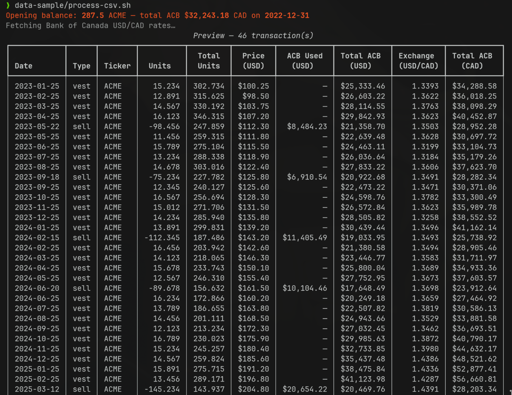
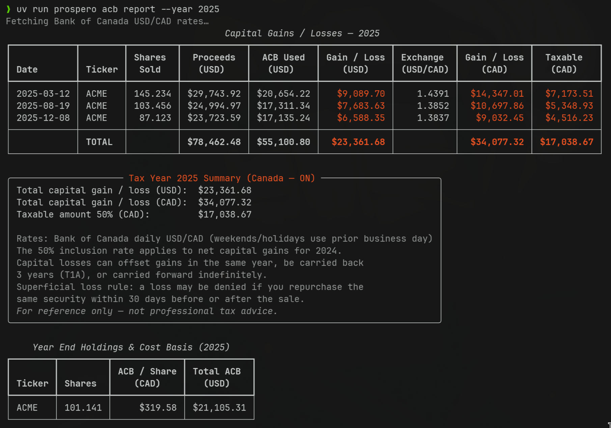
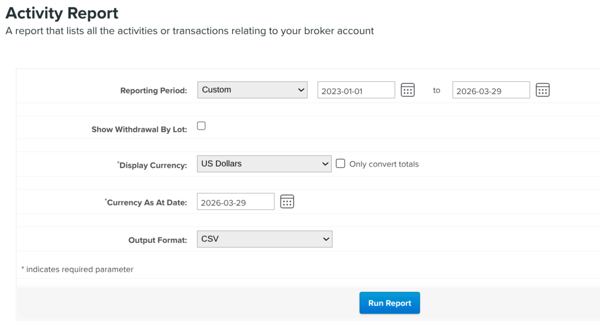

# prospero-acb

Adjusted Cost Basis (ACB) tracker for Canadian stock grants (RSUs) and capital gains/losses reporting.




## Background

Canada uses the **identical-shares average cost method** (ITA s.47): all shares of the same ticker are tracked together as a single cost basis position. The per-share ACB is always `total_acb / total_shares`. When RSUs vest, CRA treats the **Fair Market Value (FMV)** — the stock's closing price on the vest date — as employment income (reported on your T4), so ACB equals FMV — only appreciation after vesting becomes a capital gain on sale.

<details>
<summary><strong>Caveats and limitations</strong></summary>

**Import your full history, not one year at a time.** Because each sale's ACB depends on all prior acquisitions and dispositions, the ledger must contain every transaction from the beginning. Use `prospero-acb report --year YYYY` to slice out the capital gains for any specific tax year.

**USD-denominated grants only.** This tool assumes stock prices and proceeds are in USD (the currency used by most US-listed RSU grants). Bank of Canada rates are fetched to convert to CAD for reporting. If your grants are denominated in another currency, the code will need to be updated.

**Stock splits are not supported.** The ACB calculation does not account for split adjustments. Export only split-free history, or manually normalize quantities and prices before importing.

</details>

## How RSU ACB works end-to-end

Full lifecycle of a US-listed RSU grant held by a Canadian resident, from vest to sale.

- **(i) Shares vest — gross units (USD), taxed, net units land in your account.**
  Everything at vest is in USD. The broker calculates employment income as `gross_units × FMV_usd`, withholds shares to cover the tax (~40-50% for high earners in Ontario), and deposits only the *net* units.
  - Record only the net units as a `vest` transaction (with the USD FMV as the price)
  - The withheld shares were liquidated by the broker and never owned by you

- **(ii) USD FMV at vest is converted to CAD and becomes your ACB.**
  CRA treats the USD FMV at vest as employment income, already reported on your T4. Because you were taxed on that amount, your cost basis equals that FMV.
  - Prospero fetches the Bank of Canada USD/CAD rate for the *vest date* and converts `net_units × FMV_usd` to CAD
  - That CAD amount accumulates into the ACB pool
  - You cannot use today's exchange rate to reconstruct historical CAD costs — each lot's rate is permanently tied to its vest date and inextricably folded into the accrued CAD ACB

- **(iii) Shares pool together (identical-shares average cost) — ACB tracked in CAD.**
  Canada does not track lots individually. All shares of the same ticker merge into one pool: `(total_shares, total_acb_cad)`.
  - Per-share ACB at any point is `total_acb_cad / total_shares` (in CAD)
  - Each new vest or buy adds to both numbers; each sale removes a proportional slice

- **(iv) Sale proceeds in USD — converted to CAD at the sale date rate, gain computed in CAD.**
  When you sell, the USD proceeds stay in your brokerage account.
  - Prospero converts using the Bank of Canada rate for the *sale date*: `proceeds_cad = shares_sold × price_usd × rate`
  - Capital gain: `proceeds_cad - (acb_per_share_cad × shares_sold)` (all CAD)
  - Half of the net gain is taxable (50% inclusion rate, `_INCLUSION_RATE` in `acb_engine.py`)

- **(v) Pool shrinks; remaining shares keep the same per-share ACB (CAD).**
  After the sale, `total_shares` and `total_acb_cad` are both reduced proportionally. The per-share ACB (in CAD) for remaining shares is unchanged — this is a property of the average-cost method.

- **(vi) Cross-year dependency — always import full history.**
  A 2023 partial sale reduces the CAD pool before any 2024 sale computes its ACB. This is why `prospero-acb report --year YYYY` replays *all* transactions from the beginning; it just filters output to the requested year.

## Workflow

1. Import your full transaction history (or enter events manually)
   - Transactions are saved to `~/.prospero/acb_ledger.json`
   - If the ledger gets into a bad state, delete that file and re-import
2. Run `prospero-acb report --year YYYY` for capital gains/losses, or `prospero-acb show` for your current cost basis

The `prospero acb` subcommand group works identically.

## Morgan Stanley Activity Report

<details>
<summary><strong>Needed settings on export</strong></summary>



Key: **USD** currency, to avoid crappy (fixed single day) currency conversions.

</details>

Unpack the Activity Report zip and point `import-ms` at the folder — no manual CSV prep needed.

> [!NOTE]
> If you held shares before your earliest activity report (common when importing only recent years), the import will fail with an oversell error. Seed the ledger first:
>
> 1. Log in to MS Stockplan Connect → Reports → Vested Share Holdings
> 2. Set the date to **Dec 31 of the year before your earliest import** (e.g. Dec 31, 2024 if importing from 2025 onward)
> 3. Make sure to specify **USD** currency (native)
> 4. Note *Number of Shares* and *Acquisition Value* for your ticker
>    *(MS defines Acquisition Value as FMV at vest × shares held, which equals total ACB for RSUs)*
> 5. Run:
>    ```bash
>    prospero-acb add-opening-balance --ticker GOOG --date 2024-12-31 \
>      --shares <Number of Shares> --opening-acb-usd <Acquisition Value>
>    ```

```bash
prospero-acb import-ms --dir data-sample/complete/ --ticker GOOG --dry-run
prospero-acb import-ms --dir data-sample/complete/ --ticker GOOG
```

The ticker must be supplied as it is not included in the MS files. `--dry-run` previews without saving.

## CSV import

For other brokers, prepare a CSV from your transaction history:

```
date,type,ticker,quantity,price
2024-01-15,vest,AAPL,25,185.50
2024-03-01,buy,AAPL,10,190.00
2024-06-15,sell,AAPL,20,210.00
```

| Column | Format | Notes |
|---|---|---|
| `date` | YYYY-MM-DD | Transaction date |
| `type` | `vest` / `buy` / `sell` | Case-insensitive |
| `ticker` | e.g. `AAPL` | Uppercased automatically |
| `quantity` | positive number | Shares involved |
| `price` | price per share in USD | FMV for vest; purchase price for buy; proceeds for sell |

```bash
# Preview without saving
prospero-acb import --file transactions.csv --dry-run

# Import (validates all rows before writing — reports every error at once)
prospero-acb import --file transactions.csv
```

## Manual entry

```bash
# Seed shares held before your transaction history begins
prospero-acb add-opening-balance --ticker GOOG --date 2024-12-31 \
  --shares 100 --opening-acb-usd 15000

# Record an RSU vesting event (FMV at vest = ACB)
prospero-acb add-vest --ticker AAPL --date 2024-01-15 --quantity 25 --fmv 185.50

# Record a regular market purchase
prospero-acb add-buy --ticker AAPL --date 2024-03-01 --quantity 10 --price 190.00

# Record a sale
prospero-acb add-sell --ticker AAPL --date 2024-06-15 --quantity 20 --price 210.00
```

## Reporting

```bash
# Show current cost basis for all tickers (shares held and average cost)
prospero-acb show

# Capital gains/losses for a tax year (defaults to the previous calendar year)
prospero-acb report
prospero-acb report --year 2024
```

The report shows proceeds, ACB used, and capital gain/loss per sale, with the 50% inclusion amount (the taxable portion). It also notes the superficial loss rule and capital loss carryover rules. Bank of Canada USD/CAD rates are fetched automatically.

## JSON output

```bash
prospero-acb show --json
prospero-acb report --year 2024 --json
```

`report --json` outputs `{ "year", "gains": [...], "holdings": [...], "total_taxable_cad" }`.

## Data storage

Transactions are stored in `~/.prospero/acb_ledger.json`. Exchange rates are cached in `~/.prospero/fx_rates_cache.json` to avoid repeated Bank of Canada API calls.
