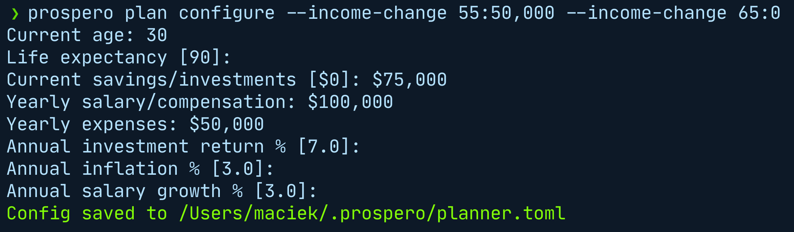
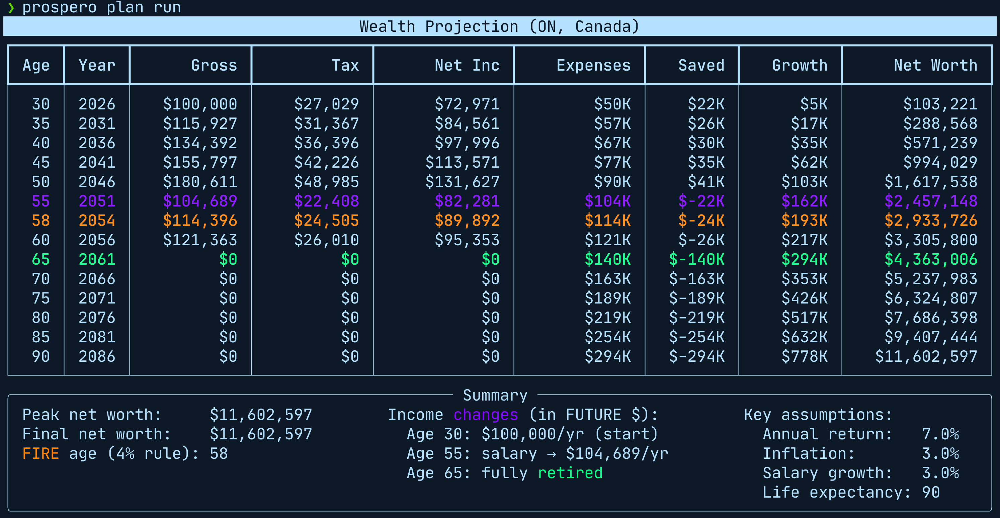

# prospero-plan




Long-term wealth planner — project net worth year-by-year with salary changes, retirement modelling, FIRE detection, and Canadian taxes.

## Commands

```bash
# Configure your plan (interactive prompts)
prospero-plan configure

# Configure with income changes: semi-retire at 55, fully retire at 65
prospero-plan configure --income-change 55:80000 --income-change 65:0

# Auto-retire the year after reaching FIRE (4% rule)
prospero-plan configure --income-change 0:0

# Run projection
prospero-plan run

# Show every year (default: every 5th)
prospero-plan run --every 1

# View saved config
prospero-plan show-config
```

The `prospero plan` subcommand group works identically:

```bash
prospero plan configure
prospero plan run
```

## Income changes

Use `--income-change AGE:SALARY` (repeatable) to model salary transitions at any age. The salary is expressed in **today's dollars** — it is inflated forward to the transition year using the configured `inflation_pct`.

| Example | Meaning |
|---|---|
| `--income-change 65:0` | Fully retire at 65 |
| `--income-change 55:80000 --income-change 65:0` | Semi-retire to $80K at 55, fully retire at 65 |
| `--income-change 0:0` | Auto-retire the year after FIRE is reached |
| *(omit entirely)* | Work indefinitely at the configured salary |

Each new salary is a hard reset at that age; the global `salary_growth_pct` applies from there forward.

## FIRE detection

Each year the planner checks: if `net_worth × 0.04 ≥ expenses`, FIRE is reached (4% rule). An income change with `age=0` triggers the year *after* FIRE is detected.

## Tax support

The planner calculates taxes using 2025 Canadian federal + Ontario provincial rates:

- Federal progressive income tax brackets
- Ontario progressive brackets + Ontario surtax
- CPP/CPP2 employee contributions
- EI premiums
- Bracket indexation to inflation over time

## JSON output

```bash
prospero-plan run --json
```

Outputs a `PlanSummary` with the full projection array, FIRE age, peak net worth, and final net worth. The `--every` flag is ignored in JSON mode — all years are included.

## Data storage

Configuration is stored in `~/.prospero/planner.toml` (human-editable).
