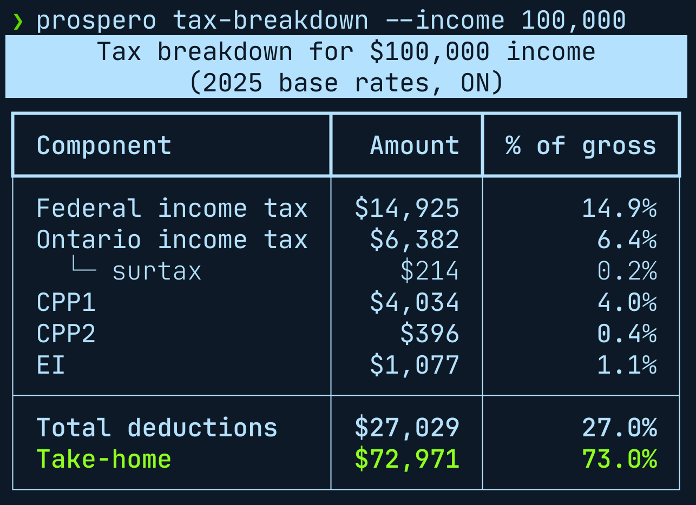

# prospero-tax



Canadian income tax breakdown — federal + Ontario provincial rates for 2025.

Breaks down federal income tax, Ontario income tax (including surtax), CPP1, CPP2, and EI — showing the amount and effective rate for each component.

## Commands

```bash
# Show a detailed tax breakdown for a given income
prospero-tax --income 150000

# Uses your configured planner salary if --income is omitted
prospero-tax
```

The `prospero tax-breakdown` top-level command works identically:

```bash
prospero tax-breakdown --income 150000
```

## JSON output

```bash
prospero-tax --income 150000 --json
```

Outputs:

```json
{
  "income": "150000",
  "federal": "...",
  "ontario_base": "...",
  "ontario_surtax": "...",
  "ontario": "...",
  "cpp1": "...",
  "cpp2": "...",
  "ei": "...",
  "total": "...",
  "take_home": "..."
}
```

## Rates used

2025 Canadian federal + Ontario provincial rates:

- Federal progressive income tax brackets (BPA: $16,129)
- Ontario progressive brackets + Ontario surtax (BPA: $11,865)
- CPP1: 5.95% on earnings up to $71,300 (basic exemption: $3,500)
- CPP2: 4.00% on earnings $71,301–$81,200
- EI: 1.64% on earnings up to $65,700

Bracket thresholds are the 2025 base; the wealth planner inflates them forward when projecting future years.
